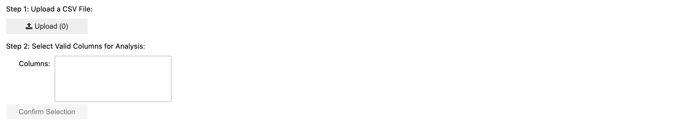
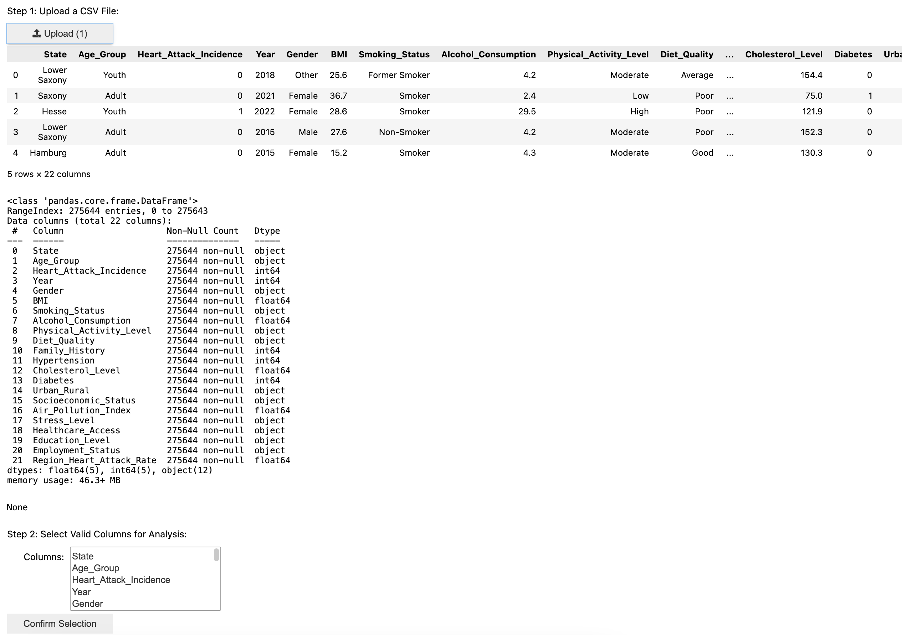
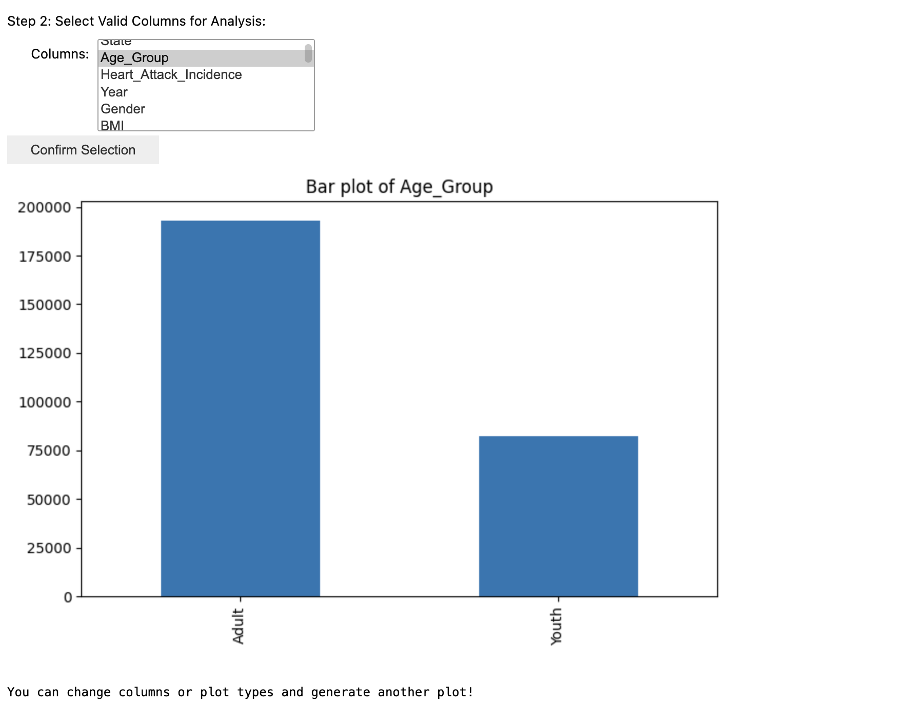

# Interactive-Data-Exploration-Tool

This project provides an interactive data exploration tool using Jupyter Notebook widgets. It allows users to upload a CSV file, select columns for analysis, and generate various plots to explore the data visually.

---

## Features

1. **CSV File Upload**: Easily upload a CSV file for analysis.
2. **Dynamic Column Selection**: Select specific columns from the dataset for exploration.
3. **Plot Types**: Generate the following types of visualizations:
   - Histogram
   - Bar Plot
   - Box Plot
   - Scatter Plot
4. **Interactive Widgets**: Use intuitive widgets to select columns, configure plot types, and visualize data directly in Jupyter Notebook.

---

## Installation

1. Ensure you have Python installed (version 3.7 or later is recommended).
2. Install the required libraries using pip:
   ```bash
   pip install pandas matplotlib ipywidgets
   ```
3. Enable Jupyter Notebook widgets:
   ```bash
   jupyter nbextension enable --py widgetsnbextension
   ```

---

## Usage

1. **Launch Jupyter Notebook**: Open Jupyter Notebook in your terminal or IDE.
2. **Run the Script**: Copy and paste the script into a Jupyter Notebook cell and run it.
3. **Step 1: Upload a CSV File**:
   - Use the file upload widget to upload a CSV file.
   - The script will display the first few rows and basic information about the dataset.
4. **Step 2: Select Columns for Analysis**:
   - Use the dropdown to select columns of interest.
   - Click the "Confirm Selection" button.
5. **Step 3: Generate Plot**:
   - Choose a plot type (Histogram, Bar, Box, or Scatter).
   - Click the "Generate Plot" button to visualize the data.
6. **Iterate**: You can change the column selection or plot type and regenerate plots as needed.

---

## Requirements

- Python 3.7+
- Jupyter Notebook or JupyterLab
- Libraries:
  - pandas
  - matplotlib
  - ipywidgets

---

## Limitations

1. **Scatter Plots**: Require exactly two columns for visualization.
2. **File Format**: Only CSV files are supported.
3. **Column Selection**: Columns must be numeric for certain plot types like Histograms or Box Plots.

---

## Example Workflow

1. **Upload CSV File**:
   - Click the file upload button and select your file.
2. **Select Columns**:
   - Choose columns to analyze using the dropdown.
3. **Generate Plots**:
   - Select a plot type and click "Generate Plot" to view the visualizations.


<br><br>


<br><br>



---

## Customization

You can extend or modify the script to add more features, such as:
- Support for additional file formats.
- Advanced visualizations like heatmaps or time-series plots.
- Custom preprocessing steps (e.g., handling missing values or outliers).

---

## Support

For any issues or suggestions, please raise an issue or contact the maintainer.

Enjoy exploring your data! 😊
